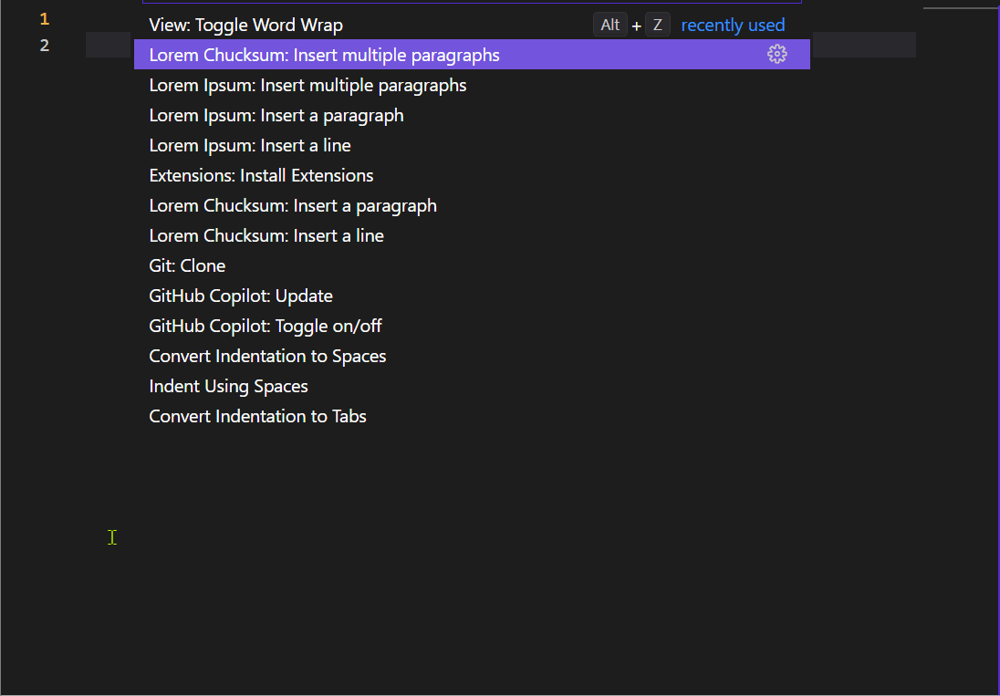

A VS Code extension that generate and insert lorem ipsum text based on Chuck Norris fun facts. "Chuck Norris makes unions cry."

To use the extension, open the command palette (<kbd>F1</kbd> or <kbd>cmd/ctrl+shift+p</kbd>, type "lorem chucksum" and select to insert either a single line or single/more paragraph.

## Features

It is very easy to generate some lines or paragraphs of text inspired by Chuck Norris:




## Commands and custom keybindings

The following commands are added:

- `vscode-lorem-ipsum-chuck-norris.line`
- `vscode-lorem-ipsum-chuck-norris.paragraph`
- `vscode-lorem-ipsum-chuck-norris.multipleParagraphs`

By default they don't have keybindings, but [you can add a custom keybinding](https://code.visualstudio.com/docs/getstarted/keybindings#_advanced-customization). For example:

```json
{
  "key": "ctrl+shift+l",
  "command": "vscode-lorem-ipsum-chuck-norris.multipleParagraphs",
  "when": "editorTextFocus"
}
```

## Credits

- Tyler Leonhardt for demonstrating [building a VS extension](https://www.youtube.com/watch?v=PGAu06_E_BU)
- Daniel Imms providing an example [lorem-ipsum extension](https://github.com/Tyriar/vscode-lorem-ipsum)